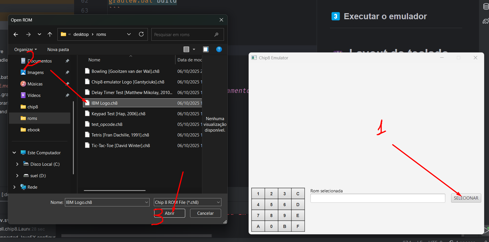

# 🕹️ CHIP-8 Emulator (Java / Gradle)

> Um emulador completo da máquina virtual CHIP-8, desenvolvido em **Java**, com base no ciclo de fetch-decode-execute e suporte a entrada de teclado, temporizadores e renderização gráfica.

---

## 📖 Sobre o projeto

O **CHIP-8** é uma máquina virtual criada na década de 1970 para facilitar o desenvolvimento de jogos simples em computadores domésticos.  
Este projeto implementa um **emulador CHIP-8 em Java**, com o objetivo de estudar emulação, arquitetura de CPU e manipulação de gráficos e eventos de entrada.

---

## ⚙️ Funcionalidades principais

- 🔢 Decodificação completa das instruções do CHIP-8  
- ⏱️ Temporizadores de delay e som rodando a 60 Hz  
- 🧮 Implementação do ciclo **fetch → decode → execute**  
- 🎨 Renderização gráfica em resolução 64 × 32 pixels  
- ⌨️ Suporte a mapeamento de teclas hexadecimais  
- 📦 Execução de ROMs compatíveis com CHIP-8  
- 🧰 Estrutura modular e extensível (CPU, memória, display, teclado)  

---

## 🧩 Estrutura do projeto

```
.
├── gradle/
│   └── wrapper/             # arquivos do wrapper do Gradle
├── src/
│   └── main/
│       ├── java/            # código-fonte principal (CPU, memória, display etc.)
│       └── resources/       # recursos adicionais (fonts, ROMs, ícones)
├── build.gradle.kts         # configuração do Gradle (Kotlin DSL)
├── settings.gradle.kts
├── gradlew / gradlew.bat    # wrappers para executar o Gradle localmente
└── README.md
```

---

## 🚀 Como executar


### 1️⃣ Clonar o repositório

```bash

git clone https://github.com/Swellington-Soares/chip8.git
cd chip8

```

### 2️⃣ Compilar o projeto

No Linux/macOS:
```bash

./gradlew build

```

No Windows:
```bash

gradlew.bat build

```

### 3️⃣ Executar o emulador



* Abra o emulador
* Clique no botão selecionar
* Navegue onde tá sua rom e abra

---

## 🎮 Layout do teclado (mapeamento padrão)

```
1 2 3 C  → 1 2 3 4
4 5 6 D  → Q W E R
7 8 9 E  → A S D F
A 0 B F  → Z X C V
```

---

## 🧪 Testes e validação

Para validar a precisão do emulador, é possível usar ROMs de teste, como:
- [Timendus CHIP-8 test suite](https://github.com/Timendus/chip8-test-suite)
- [corax89/chip8-test-rom](https://github.com/corax89/chip8-test-rom)

Essas ROMs ajudam a confirmar se a execução de cada opcode está correta e se o comportamento de temporizadores e gráficos segue o padrão.

---

## 🧭 Próximos passos / melhorias futuras

- Suporte a **Super-CHIP** (instruções e resolução ampliadas)  
- Sistema de **debug visual** (memória, registradores, stack, tela)  
- Opções de **configuração de quirks**  
- Reimplementação gráfica com JavaFX ou Skia para renderização moderna  
- Suporte a áudio real (emulação de beep)  


## 📜 Licença

Este projeto é distribuído sob a licença **MIT**.  
Consulte o arquivo [`LICENSE`](LICENSE) para mais informações.

---

## 👤 Autor

**Swellington Soares**  
🔗 [github.com/Swellington-Soares](https://github.com/Swellington-Soares)

---

> 💡 *Este projeto é um excelente estudo prático sobre arquitetura de CPU, decodificação de instruções e design de emuladores clássicos.*
